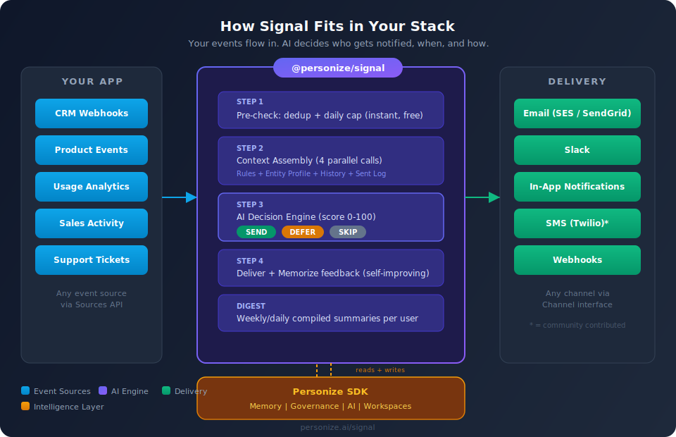

<p align="center">
  
</p>

# @personize/signal

**Stop blasting. Start deciding.** Signal is an AI-powered notification engine that knows *when to talk and when to stay silent*.

Most notification systems are dumb pipes: event happens, message goes out. Signal adds a brain. It scores every event (0-100), assembles cross-team context from memory, and makes a real-time decision: **SEND**, **DEFER** to a digest, or **SKIP** entirely.

The result? Your users get fewer, better notifications — and your engagement metrics go up, not down.

---

## Generative Notifications

Signal doesn't send templates. It **generates** messages.

Pass in raw, unstructured data — JSON payloads, CRM field dumps, usage logs, support transcripts — and Signal transforms them into messages your customers actually want to read. The AI writes the subject line, the body, and picks the right tone based on your brand voice and the recipient's history.

```typescript
// You send this:
manual.emit({
    type: 'usage.milestone',
    email: 'jane@acme.com',
    data: {
        api_calls_total: 10247,
        most_used_endpoint: '/v1/memory/recall',
        growth_rate: '340% week-over-week',
        plan: 'pro',
        days_since_signup: 12,
    },
    timestamp: new Date().toISOString(),
});

// Signal delivers this (generated, not templated):
//
//   Subject: "You just crossed 10K API calls — here's what's working"
//   Body: "Jane, your recall endpoint usage grew 340% this week.
//          That's the fastest ramp we've seen from a Pro account.
//          Most teams at this stage benefit from batch memorization
//          to keep up with retrieval volume..."
```

No templates to maintain. No copy variations to A/B test. No localization files to manage. The AI writes every message fresh, grounded in what it knows about the recipient and what your org's guidelines say about tone, length, and compliance.

---

## Why Signal Exists

| Problem | Signal's Answer |
|---------|----------------|
| Users drown in notifications and start ignoring them | AI scores every event and only sends what matters |
| Teams blast the same contact from different tools | Cross-team memory prevents duplicate outreach |
| No way to know if a notification helped or annoyed | Feedback loop memorizes outcomes and improves over time |
| Digests are either nonexistent or generic | Personalized weekly/daily digests compiled from deferred items |
| Writing and maintaining notification templates is expensive | Generative messages — pass raw data, get polished copy out |
| Adding "smart" notifications requires months of ML work | Drop-in engine — works in an afternoon, improves on its own |

## What Makes Signal Different

**Context-aware decisions, not rules.** Signal doesn't use if/else trees. It assembles your organization's guidelines, the recipient's full history, and recent activity — then asks an AI to score the notification. The AI explains its reasoning, so you can audit every decision.

**Self-improving.** Every SEND/DEFER/SKIP decision is memorized. Next time Signal evaluates an event for the same person, it knows what worked and what didn't. The more you use it, the smarter it gets.

**Governance built in.** Your brand voice, quiet hours, frequency limits, and compliance rules are loaded automatically via [Personize SmartContext](https://personize.ai). Every notification respects your org's guardrails without per-event configuration.

**Modular edges, intelligent core.** Channels (email, Slack, SMS, in-app) and sources (webhooks, CRM, product events) are plug-and-play. The AI decision engine is the value — you don't rebuild it, you just connect your edges.

---

## Quick Start

```bash
npm install @personize/signal @personize/sdk
```

```typescript
import { Personize } from '@personize/sdk';
import { Signal, ConsoleChannel, ManualSource } from '@personize/signal';

const client = new Personize({ secretKey: process.env.PERSONIZE_KEY! });
const manual = new ManualSource();

const signal = new Signal({
    client,
    channels: [new ConsoleChannel()],
    sources: [manual],
});

await signal.start();

// Push an event — Signal decides whether to notify
manual.emit({
    id: 'evt_001',
    type: 'user.signup',
    email: 'jane@acme.com',
    data: { plan: 'pro', source: 'website' },
    timestamp: new Date().toISOString(),
});
```

Or trigger synchronously and inspect the AI decision:

```typescript
const result = await signal.trigger({
    id: 'evt_002',
    type: 'usage.drop',
    email: 'jane@acme.com',
    data: { metric: 'daily_logins', dropPercent: 40 },
    timestamp: new Date().toISOString(),
});

console.log(result.action);    // 'SEND' | 'DEFER' | 'SKIP'
console.log(result.score);     // 0-100
console.log(result.reasoning); // "Usage dropped 40% for a Pro user who was
                                //  highly active last week. This warrants
                                //  immediate outreach to prevent churn."
```

---

## How the Engine Works

Every event passes through a 4-stage pipeline:

### 1. Pre-Check (instant, zero cost)
Deduplication and daily caps catch obvious skips before any AI calls. Same event type for the same person within 6 hours? Skipped. Over the daily limit? Skipped. No API calls, no latency.

### 2. Context Assembly (4 parallel calls)
Signal pulls four dimensions of context simultaneously:
- **Governance rules** — your org's notification policies, brand voice, quiet hours
- **Entity profile** — compiled digest of everything known about this person
- **Semantic context** — relevant memories (past interactions, preferences, history)
- **Sent log** — what was recently sent to avoid fatigue

### 3. AI Decision (scored 0-100)
A single AI call receives all context and scores the notification:
- **SEND (>60)** — deliver now via the configured channel
- **DEFER (40-60)** — save for the next digest (weekly/daily summary)
- **SKIP (<40)** — not worth sending, log and move on

Every decision includes a human-readable `reasoning` field you can inspect or surface in your UI.

### 4. Deliver + Learn
On SEND: the channel delivers the message. On DEFER: the event is stored for digest compilation. Either way, the decision is memorized back to the person's profile — creating a feedback loop that makes future decisions smarter.

---

## Built-in Channels

| Channel | Use Case | Setup |
|---------|----------|-------|
| `ConsoleChannel` | Development and testing | None |
| `SesChannel` | AWS SES email | `{ sourceEmail, region? }` |
| `SendGridChannel` | SendGrid email | `{ apiKey, fromEmail }` |
| `SlackChannel` | Slack webhooks | `{ webhookUrl }` |
| `InAppChannel` | Bridge to your UI | `handler: (recipient, payload) => ...` |

Need SMS, Teams, Discord, or push notifications? Implement the `Channel` interface — it's one method: `send(recipient, payload) => DeliveryResult`. See [templates/CHANNEL_TEMPLATE.md](templates/CHANNEL_TEMPLATE.md).

## Built-in Sources

| Source | Use Case | Setup |
|--------|----------|-------|
| `ManualSource` | Events from your code | `.emit(event)` |
| `WebhookSource` | HTTP webhooks into Signal | `{ path?, secret?, parser? }` |

Need HubSpot, Stripe, Segment, or custom sources? Implement the `Source` interface. See [templates/SOURCE_TEMPLATE.md](templates/SOURCE_TEMPLATE.md).

---

## Digest Pipeline

Deferred notifications (score 40-60) don't disappear. Signal stores them in memory and compiles personalized digests on your schedule:

```typescript
// Daily digest at 9 AM on weekdays
signal.schedule('daily-digest', '0 9 * * 1-5', async () => {
    const users = await getActiveUsers();
    const result = await signal.digest.runBatch(users);
    console.log(`Sent: ${result.sent}, Skipped: ${result.skipped}`);
});
```

Each digest is unique per user — compiled from their specific deferred items with AI-generated summaries, not template fill-in-the-blanks.

## Multi-Team Context

Signal solves the "left hand doesn't know what the right hand is doing" problem. When Sales, Product, and Marketing all feed events into Signal, the AI sees the full picture before deciding:

```typescript
// Product team tracks usage milestones
manual.emit({ type: 'usage.milestone', email: 'jane@acme.com', data: { milestone: '100_api_calls' }, ... });

// Sales team tracks deal progression
manual.emit({ type: 'deal.stage_changed', email: 'jane@acme.com', data: { stage: 'proposal' }, ... });

// Signal evaluates with BOTH contexts — avoids sending a sales nudge
// right after a product celebration email
```

## Workspace Collaboration

Signal includes workspace utilities for cross-team coordination on entity records:

```typescript
await signal.workspace.addTask('jane@acme.com', {
    title: 'Follow up on trial expiry',
    priority: 'high',
    assignee: 'sales',
});

await signal.workspace.addNote('jane@acme.com', {
    content: 'Strong interest in enterprise features during demo',
    tags: ['sales', 'enterprise'],
});
```

---

## Configuration

```typescript
const signal = new Signal({
    client,
    channels: [new SesChannel({ sourceEmail: 'hello@yourapp.com' })],
    sources: [new WebhookSource({ secret: process.env.WEBHOOK_SECRET })],
    engine: {
        dailyCap: 5,                        // max notifications per person per day
        deduplicationWindowMs: 6 * 60 * 60 * 1000, // skip same event within 6h
        maxEvaluationsPerMinute: 20,         // rate limit for batch processing
        concurrency: 5,                      // max parallel evaluations
        memorize: true,                      // feedback loop (recommended)
        workspaceUpdates: false,             // auto-create workspace entries
    },
});
```

### Full Config Reference

| Field | Type | Default | Description |
|-------|------|---------|-------------|
| `client` | `Personize` | required | Authenticated SDK client |
| `channels` | `Channel[]` | required | At least one delivery channel |
| `sources` | `Source[]` | `[]` | Event sources |
| `scheduler` | `Scheduler` | `CronScheduler` | Scheduler implementation |
| `engine.memorize` | `boolean` | `true` | Record decisions in memory |
| `engine.concurrency` | `number` | `5` | Max parallel evaluations |
| `engine.dailyCap` | `number` | `5` | Max notifications per email/day |
| `engine.deduplicationWindowMs` | `number` | `21600000` | Dedup window (6h default) |
| `engine.maxEvaluationsPerMinute` | `number` | `20` | Rate limit |
| `engine.workspaceUpdates` | `boolean` | `false` | Auto workspace entries |

---

## Examples

See the [examples/](examples/) directory for production-ready patterns:

| Example | What It Shows |
|---------|---------------|
| [quickstart/](examples/quickstart/) | Minimal setup: one source, one channel, first decision |
| [saas-onboarding/](examples/saas-onboarding/) | Signup-to-nurture-to-convert sequence |
| [sales-alerts/](examples/sales-alerts/) | Usage drop alerts routed to sales reps |
| [weekly-digest/](examples/weekly-digest/) | Deferred items compiled into personalized weekly digest |
| [multi-team/](examples/multi-team/) | Product + Sales + Marketing on same entity records |

## Contributing

Channels and Sources are community-driven. Adding one is straightforward:

- **New Channel**: Implement `send(recipient, payload) => DeliveryResult`. [Template](templates/CHANNEL_TEMPLATE.md)
- **New Source**: Implement `start(emitter)` and `stop()`. [Template](templates/SOURCE_TEMPLATE.md)

## Requirements

- Node.js 18+
- `@personize/sdk` >= 0.6.0
- Optional: `@aws-sdk/client-ses` >= 3.0.0 (for SES email channel)

## License

Apache-2.0 — see [LICENSE](LICENSE).
